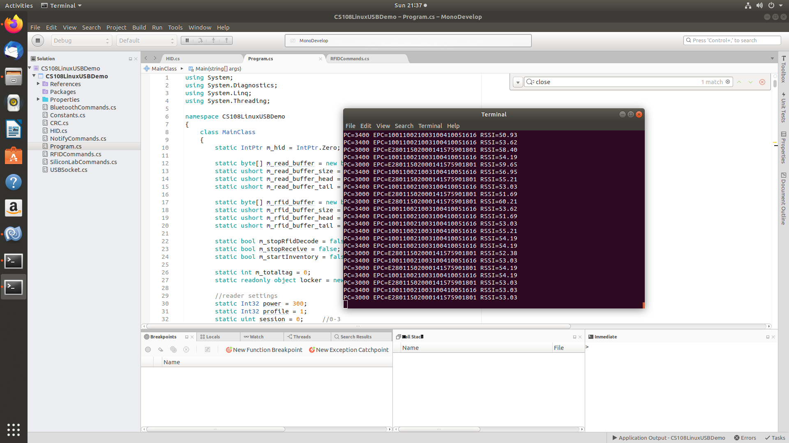

**Objectives:** 

* Connect to CS108 with a Linux host or any embedded Linux device through USB

**Technical Level:** Intermediate/Advanced

**Prerequisits:**

* CS108 basic operations [CS108 User's Manual](https://www.convergence.com.hk/downloads/cs108/)
* Basic knowledge of Linux terminal and commands
* Basic knowledge of gcc toolchain on Linux
* C# programming with Visual Studio or MonoDevelop on Linux

**Recipe:**

1. [Compile the HID-UART API Library on your Linux Host](#1)
2. [Tool for Resetting USB Device Connected through *libusb*] (#2)  
3. [Set up development environment in Visual Studio on the PC](#3)
4. [Build and Run the Demo App](#4)

## Compile the HID-UART API Library on your Linux Host

This will generate the `libslabhiddevice.so` file so that the C# code will be invoking this library for communicating with the CS108.

Please look under the `USBDriver` folder and you can find the source code and instruction for building from source.

* Install dependencies (Ubuntu)
```
$ sudo apt-get install libusb-1.0-0-dev g++
``` 
* Build the library
```
$ make 
```
* Install library to /usr/lib (default reference path by Mono runtime)
```
$ sudo make install INSTALLPATH=/usr
```
* Copy the file SiliconLabs.rules under `USBDriver/slabhiddevice/doc` to `/etc/udev/rules.d` 

This allows libusb-1.0 to have read/write access to the device

## Tool for Resetting USB Device Connected through *libusb* 
We suggest to reset the CS108 libusb device every before making connection.

You can utilize open source tool such as the following 

[ ralight/usb-reset ](https://github.com/ralight/usb-reset)

Download or clone the repository to your local.  You can simply run `make` command to build from the source code.  Copy the binary `usb-reset` to your local executable path such as:

```
> sudo cp usb-reset /usr/local/bin
``` 

Then, your program can invoke the `usb-reset` command within the code.


## Install Mono Runtime on Linux

* Install the complete runtime and libraries (Ubuntu)
```
$ sudo apt install mono-devel
```

## Build and Run the Demo App

You can open the solution with MonoDevelop IDE, where you can build the project.  At the same time, you can use `msc` at the terminal that comes with Mono to build the code.  




