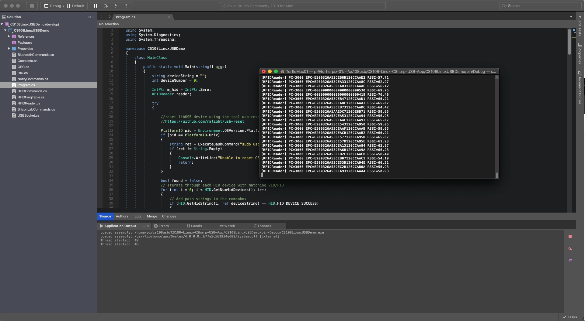

**Objectives:** 

* Connect to CS108 with a Linux host or any embedded Linux device through USB

**Technical Level:** Intermediate/Advanced

**Prerequisits:**

* CS108 basic operations [CS108 User's Manual](https://www.convergence.com.hk/downloads/cs108/)
* Basic knowledge of Linux terminal and commands
* Basic knowledge of gcc toolchain on Linux
* C# programming with Visual Studio or MonoDevelop on Linux

**Recipe:**

1. [Compile the HID-UART API Library on your Linux Host](#1)
2. [Tool for Resetting USB Device Connected through libusb](#2)  
3. [Set up development environment in Visual Studio on the PC](#3)
4. [Build and Run the Demo App](#4)

## Compile the HID-UART API Library on your Linux Host

This will generate the `libslabhiddevice.so` file so that the C# code will be invoking this library for communicating with the CS108.

Please look under the `USBDriver` folder and you can find the source code and instruction for building from source.

* Install dependencies (Ubuntu)
```
$ sudo apt-get install g++
```
You will also need libusb.  However, the version that you download from the package repository could be outdated and we suggest to install the latest version (v1.0.23 or later).  You can download the source code pakage from **[here](https://github.com/libusb/libusb/releases)**.  Extract the package at your local and run `./configure` for generating the Makefile.  At last, run the following to build and install libusb on your machine:
```
$ make
$ make install
```
* After installing all the dependencies, build the library libslabhiddevice.so by running the following under /USBDriver/slabhiddevice: 
```
$ make 
```

* Install library to /usr/lib (default reference path by Mono runtime)
```
$ sudo make install INSTALLPATH=/usr
```
* Copy the file SiliconLabs.rules under `USBDriver/slabhiddevice/doc` to `/etc/udev/rules.d` 

This allows libusb-1.0 to have read/write access to the device

## Tool for Resetting USB Device Connected through *libusb* 
We suggest to reset the CS108 libusb device every before making connection.

You can utilize open source tool such as the following 

[ ralight/usb-reset ](https://github.com/ralight/usb-reset)

Download or clone the repository to your local.  You can simply run `make` command to build from the source code.  Copy the binary `usb-reset` to your local executable path such as:

```
> sudo cp usb-reset /usr/local/bin
``` 

Then, your program can invoke the `usb-reset` command within the code.

In the demo code, it will first detect the OS (Linux/Windows).  If the code is run under Linux, the usb-reste will be invoked.

## Install Mono Runtime on Linux

* Install the complete runtime and libraries (Ubuntu)
```
$ sudo apt install mono-devel
```

## Build and Run the Demo App

You can open the solution with MonoDevelop IDE, where you can build the project.  If you are running MacOS, you can also compile the code with Visual Studio for Mac and then deploy/debug on your Linux device.

The demo app is also compatible with Windows.  The SLABHIDDevice.dll driver is located under `/USBDriver` and you can that in the working directory of the application.  Then, change all the DLLImport call in HID.cs from libslabhiddevice.so to SLABHIDDevice.dll.




